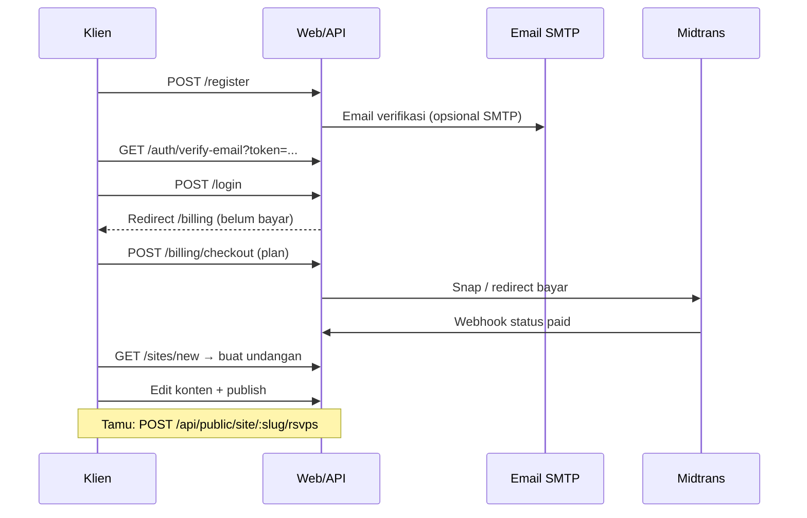

# Undangan Digital — Wedding SaaS

Platform **multi-tenant** untuk undangan pernikahan digital: landing marketing, panel klien/admin, tema undangan (EJS), RSVP & ucapan tamu, billing Midtrans, OAuth Google, dan API REST.

Dokumen ini menjelaskan **struktur proyek**, **cara menjalankan**, **alur fitur**, serta **semua endpoint** (HTML + JSON) beserta body dan respons.

---

## Daftar isi

1. [Struktur proyek](#struktur-proyek)
2. [Persyaratan & instalasi](#persyaratan--instalasi)
3. [Konfigurasi (.env)](#konfigurasi-env)
4. [Autentikasi & otorisasi](#autentikasi--otorisasi)
5. [Routing & multi-tenant](#routing--multi-tenant)
6. [Peran pengguna (roles)](#peran-pengguna-roles)
7. [Alur bisnis utama](#alur-bisnis-utama)
8. [Endpoint sistem](#endpoint-sistem)
9. [API REST — referensi lengkap](#api-rest--referensi-lengkap)
10. [Halaman web (HTML) — referensi](#halaman-web-html--referensi)
11. [Fitur per modul](#fitur-per-modul)
12. [Tema undangan](#tema-undangan)
13. [Basis data & migrasi](#basis-data--migrasi)
14. [Skrip npm](#skrip-npm)
15. [Rate limit & keamanan](#rate-limit--keamanan)
16. [Produksi](#produksi)
17. [Troubleshooting](#troubleshooting)

---

## Struktur proyek

```
wedding/
├── README.md                 ← dokumen ini
├── server/                   ← aplikasi Node.js (Express)
│   ├── src/
│   │   ├── app.js            ← entry point
│   │   ├── routes/           ← admin HTML + api/*
│   │   ├── controllers/
│   │   ├── middleware/       ← auth, csrf, subdomain, rateLimits
│   │   ├── models/queries.js ← akses MySQL
│   │   ├── services/         ← mail, midtrans, renderer, themes
│   │   └── scripts/          ← migrate, seed, backup, e2e helpers
│   ├── views/                ← template EJS panel admin
│   ├── public/               ← CSS/JS statis admin & web
│   ├── migrations/           ← SQL migrasi berurutan
│   ├── e2e/                  ← Playwright tests
│   ├── docs/production-checklist.md
│   └── .env.example
├── themes/                   ← theme1 … theme14 (manifest + template EJS)
└── uploads/                  ← file upload (gambar, audio) — di .gitignore
```

---

## Persyaratan & instalasi

| Komponen | Versi disarankan |
|----------|------------------|
| Node.js | 18+ |
| MySQL | 8.x |
| npm | 9+ |

### Langkah cepat

```bash
cd server
cp .env.example .env
# Edit .env: DB_*, JWT_SECRET, dll.

npm install
npm run migrate
npm run seed          # super_admin + situs demo
npm start             # prestart: migrate dulu, lalu server
npm run dev           # predev: migrate dulu, lalu nodemon
```

Buka: `http://127.0.0.1:3000/`

**Akun seed default** (setelah `npm run seed`):

| Email | Password | Role |
|-------|----------|------|
| `admin@wedding.local` | `admin123` | `super_admin` |

Situs demo publik: `http://127.0.0.1:3000/?site=demo` (harus `status=published`).

---

## Konfigurasi (.env)

Salin dari `server/.env.example`. Variabel penting:

| Variabel | Fungsi |
|----------|--------|
| `PORT` | Port HTTP (default `3000`) |
| `NODE_ENV` | `development` / `production` / `test` |
| `BASE_DOMAIN` | Host untuk subdomain, mis. `localhost:3000` |
| `PUBLIC_APP_URL` | URL absolut untuk email & redirect OAuth |
| `DB_*` | Koneksi MySQL |
| `DB_POOL_CONNECTION_LIMIT` | Pool koneksi (default `10`) |
| `JWT_SECRET` | Secret penandatanganan JWT (**wajib diganti production**) |
| `JWT_EXPIRES` | Masa berlaku token, mis. `7d` |
| `COOKIE_NAME` | Nama cookie sesi (default `wsaas_token`) |
| `COOKIE_SECURE` | `true` jika HTTPS |
| `REQUIRE_EMAIL_VERIFIED` | `true` = klien wajib verifikasi email sebelum billing & buat undangan |
| `MAIL_*` | SMTP untuk reset password & verifikasi |
| `GOOGLE_CLIENT_*` | OAuth Google (opsional) |
| `MIDTRANS_*` | Pembayaran |
| `PUBLIC_RSVP_WISH_WRITE_*` | Rate limit POST RSVP/wish |
| `AUTH_LOGIN_MAX` / `AUTH_REGISTER_MAX` | Rate limit login/daftar |
| `THEME_PUBLIC_MAX_AGE_MS` | Cache browser asset tema (production default 1 jam) |
| `SENTRY_DSN` | Error tracking (opsional) |

Detail produksi: [`server/docs/production-checklist.md`](server/docs/production-checklist.md).

---

## Autentikasi & otorisasi

### Cara login (dua mode)

1. **Cookie HTTP-only** — form HTML `/login` atau API login; server set cookie `COOKIE_NAME`.
2. **Bearer JWT** — header `Authorization: Bearer <token>` pada request API.

Cookie **mengalahkan** Bearer jika keduanya ada.

### Isi JWT

Payload: `{ uid, role, email, tv }` — `tv` = `token_version` di DB. Logout / ganti password / ganti email menaikkan `token_version` sehingga token lama **tidak valid**.

### CSRF (hanya halaman HTML)

- API JSON (`/api/*`) **tidak** memakai CSRF.
- Form HTML POST wajib field `_csrf` (nilai dari cookie `_csrf_tok`) atau header `X-CSRF-Token`.
- Webhook Midtrans dikecualikan dari CSRF.

### Middleware umum

| Middleware | Efek |
|------------|------|
| `loadUser` | Isi `req.user` dari JWT/cookie |
| `requireAuth` | 401 / redirect `/login` |
| `requireRole('super_admin')` | 403 jika role tidak cocok |
| `requireActivePlan` | Klien harus punya order `paid`; cek kuota saat buat undangan |
| `requireVerifiedEmailForClient` | Jika `REQUIRE_EMAIL_VERIFIED=true` |
| `ensureSiteOwnership` | API site: owner atau `super_admin` |

---

## Routing & multi-tenant

Middleware `resolveHost` menentukan `req.routeKind`:

| `routeKind` | Kondisi | Contoh |
|-------------|---------|--------|
| `landing` | Host utama, tanpa subdomain undangan | `/`, `/pricing` |
| `site` | Subdomain = slug, `?site=slug`, atau `custom_domain` | `demo.localhost:3000` |
| `admin` | Subdomain `admin` atau `?panel=admin` | (legacy/dev) |
| `api` | Subdomain `api` atau `?panel=api` | (legacy/dev) |

**Development:** undangan bisa dibuka tanpa DNS subdomain:

```
http://127.0.0.1:3000/?site=demo
http://127.0.0.1:3000/?site=preview-theme1
```

**Production:** `slug.BASE_DOMAIN` → mis. `pasangan-abc.domain.com`.

Tamu hanya melihat undangan jika `sites.status = 'published'`. API publik RSVP/wish mengembalikan **403** untuk draft.

---

## Peran pengguna (roles)

| Role | Kemampuan ringkas |
|------|-------------------|
| `super_admin` | Semua situs, kelola user, promo, landing CMS, sync tema, tanpa wajib bayar |
| `client` | Undangan milik sendiri, billing, publish (dengan slot bayar) |

---

## Alur bisnis utama

### A. Klien baru (email + password)



### B. Status workflow undangan

```
draft → in_review → approved → published
         ↓              ↓
      archived ←───────┘
```

Transisi diatur di API `PATCH /api/sites/:id` (field `status`). Publish juga via HTML `POST /sites/:id/publish`.

### C. Kuota undangan (klien)

- **1 pembayaran sukses (`paid`) = 1 slot** undangan (`site_type=invitation`).
- `requireActivePlan` memblokir `/sites/new` jika slot habis → redirect `/billing?reason=quota`.

### D. Tamu mengisi RSVP / ucapan

Tema undangan memanggil API publik (tanpa auth). Hanya situs **published**.

---

## Endpoint sistem

| Method | Path | Auth | Deskripsi |
|--------|------|------|-----------|
| GET | `/health` | Tidak | `200` teks `ok` — tanpa DB |
| GET | `/health/deep` | Tidak | `200` `{ ok, db }` atau `503` jika MySQL down |
| GET | `/uploads/...` | Tidak | File statis upload |
| GET | `/themes/:themeKey/public/...` | Tidak | Asset CSS/JS/gambar tema |
| GET | `/admin/static/...` | Tidak | Asset panel admin |
| GET | `/web/static/...` | Tidak | Asset landing |

---

## API REST — referensi lengkap

Base URL contoh: `http://127.0.0.1:3000`

Header umum untuk API terproteksi:

```http
Authorization: Bearer <jwt_token>
Content-Type: application/json
```

---

### `/api/auth` — Autentikasi

#### `POST /api/auth/login`

**Rate limit:** default 45 / 15 menit per IP.

**Body (JSON):**

```json
{
  "email": "klien@example.com",
  "password": "secret12"
}
```

| Field | Tipe | Aturan |
|-------|------|--------|
| `email` | string | Email valid |
| `password` | string | Min 6 karakter |

**Response `200`:**

```json
{
  "token": "eyJhbGciOiJIUzI1NiIs...",
  "expires_in": 604800,
  "user": {
    "id": 1,
    "email": "klien@example.com",
    "name": "Nama",
    "role": "client"
  }
}
```

+ Set-Cookie `wsaas_token` (httpOnly).

**Error:**

| Status | Body |
|--------|------|
| 400 | `{ "error": "invalid body", "details": {...} }` |
| 401 | `{ "error": "invalid credentials" }` |
| 401 | `{ "error": "invalid credentials", "hint": "use_google_oauth" }` — akun Google tanpa password lokal |
| 429 | `{ "error": "too many login attempts, try again later" }` |

**Contoh cURL:**

```bash
curl -s -X POST http://127.0.0.1:3000/api/auth/login \
  -H "Content-Type: application/json" \
  -d '{"email":"admin@wedding.local","password":"admin123"}'
```

---

#### `POST /api/auth/register`

**Rate limit:** default 20 / jam per IP.

**Body:**

```json
{
  "email": "baru@example.com",
  "password": "secret12",
  "name": "Nama Lengkap"
}
```

**Response `201`:** sama struktur login + kirim email verifikasi (jika SMTP dikonfigurasi).

**Error:** `400` invalid body, `409` `{ "error": "email already registered" }`.

---

#### `POST /api/auth/logout`

**Auth:** disarankan (Bearer/cookie). Jika `req.user` ada, `token_version` di-bump.

**Response `200`:** `{ "ok": true }` + cookie dihapus.

---

#### `GET /api/auth/me`

**Auth:** wajib.

**Response `200`:**

```json
{
  "user": {
    "id": 1,
    "email": "...",
    "name": "...",
    "role": "client",
    "auth_provider": "local",
    "google_sub": null,
    "email_verified_at": "2026-05-01 10:00:00"
  }
}
```

**Error:** `401` `{ "error": "unauthorized" }`

---

#### `PATCH /api/auth/me`

**Body:** `{ "name": "Nama Baru" }` (1–120 karakter)

**Response `200`:** `{ "user": { ... } }`

---

#### `POST /api/auth/change-password`

**Body:**

```json
{
  "currentPassword": "lama123",
  "newPassword": "baru123456"
}
```

**Response `200`:** `{ "ok": true, "token": "...", "expires_in": ... }` — token baru, sesi lama invalid.

**Error:** `400` `password_change_not_allowed` (akun Google), `401` password salah.

---

#### `POST /api/auth/change-email`

**Body:**

```json
{
  "newEmail": "baru@example.com",
  "password": "password_saat_ini"
}
```

**Response `200`:** user + token baru; email verifikasi dikirim ke alamat baru.

**Error:** `409` email sudah dipakai, `400` `email_change_requires_password`.

---

#### `POST /api/auth/forgot-password`

**Body:** `{ "email": "user@example.com" }`

**Response `200` (selalu generik — anti enumerasi):**

```json
{
  "ok": true,
  "message": "If the email is registered with a password, a reset link was sent."
}
```

Email berisi link: `{PUBLIC_APP_URL}/reset-password?token=...` (berlaku ~1 jam).

---

#### `POST /api/auth/reset-password`

**Body:**

```json
{
  "token": "<dari_email>",
  "password": "baru123456"
}
```

**Response `200`:** `{ "ok": true }`

**Error:** `400` `{ "error": "invalid or expired token" }`

---

### `/api/sites` — Manajemen undangan (auth wajib)

#### `GET /api/sites`

**Role:** `super_admin` → semua situs; `client` → milik `owner_user_id` sendiri.

**Response `200`:** `{ "sites": [ { "id", "slug", "theme_key", "status", ... } ] }`

---

#### `GET /api/sites/themes`

**Response `200`:** `{ "themes": [ { "key", "name", "broken", ... } ] }`

---

#### `GET /api/sites/themes/:key`

**Response `200`:** `{ "manifest": { ... theme.json } }`  
**Error:** `404` tema tidak ada.

---

#### `POST /api/sites` — Buat situs

**Role:** hanya `super_admin`.

**Body:**

```json
{
  "slug": "pasangan-abc",
  "theme_key": "theme3",
  "managed_by": "admin",
  "owner_user_id": 2,
  "custom_domain": null
}
```

| Field | Aturan |
|-------|--------|
| `slug` | `a-z0-9-`, 2–60 karakter, unik |
| `theme_key` | Harus ada di folder `themes/` |
| `managed_by` | `self` \| `admin` |

**Response `201`:** `{ "site": { ... } }` — konten & section default dari manifest dibuat otomatis.

---

#### `GET /api/sites/:id`

**Ownership:** owner atau super_admin.

**Response `200`:**

```json
{
  "site": { ... },
  "content": { "data": { "partner_one": "...", ... }, "theme_overrides": null },
  "sections": [ { "section_key": "hero", "enabled": 1, "sort_order": 1, ... } ],
  "manifest": { ... }
}
```

---

#### `PATCH /api/sites/:id`

**Body (semua opsional):**

```json
{
  "theme_key": "theme5",
  "status": "published",
  "managed_by": "self",
  "custom_domain": "undangan.contoh.com",
  "owner_user_id": 3
}
```

**Client** hanya boleh patch field yang tidak sensitif (bukan `status` / `owner` / `custom_domain` tanpa admin).

**Workflow `status`:** transisi harus valid (lihat tabel di [Alur bisnis](#alur-bisnis-utama)).

**Response `200`:** `{ "site": { ... } }`

---

#### `PATCH /api/sites/:id/content`

**Body:**

```json
{
  "data": {
    "partner_one": "A",
    "partner_two": "B",
    "wedding_date": "2026-12-01T18:00:00"
  },
  "theme_overrides": { "colors": { "primary": "#333" } }
}
```

Hanya key yang ada di `manifest.content_fields` yang disimpan. Field `required` tidak boleh kosong.

**Response `200`:** `{ "content": { ... } }`

---

#### `PATCH /api/sites/:id/sections`

**Body:**

```json
{
  "sections": [
    { "section_key": "hero", "enabled": true, "sort_order": 1 },
    { "section_key": "wishes", "enabled": false, "sort_order": 7, "config": {} }
  ]
}
```

**Response `200`:** `{ "sections": [ ... ] }`

---

#### `GET /api/sites/:id/rsvps`

**Response `200`:** `{ "rsvps": [ { "id", "guest_name", "guest_phone", "attendance", "guests_count", "notes", "ip", "created_at" } ] }`

---

#### `GET /api/sites/:id/wishes`

**Response `200`:** `{ "wishes": [ ... ] }` — termasuk yang belum disetujui (panel admin).

---

### `/api/sites/:siteId/collections/:table` — Koleksi konten

**Tabel yang diizinkan:** `story_items`, `events`, `gallery_items`, `gift_accounts`

#### `GET .../collections/:table`

**Response `200`:** `{ "items": [ { "id", "site_id", ...fields } ] }`

#### `POST .../collections/:table`

**Body:** field sesuai tabel, mis. `events`:

```json
{
  "event_type": "reception",
  "title": "Resepsi",
  "venue_name": "Hotel X",
  "address": "Jl. ...",
  "datetime": "2026-12-01 19:00:00",
  "map_url": "https://maps.google.com/...",
  "notes": "",
  "sort_order": 1
}
```

**Response `201`:** `{ "item": { ... } }`

#### `PATCH .../collections/:table/:id`

**Body:** subset field yang diizinkan.

**Response `200`:** `{ "item": { ... } }` — `404` jika tidak ada.

#### `DELETE .../collections/:table/:id`

**Response `200`:** `{ "ok": true }`

**Field per tabel:**

| Tabel | Field |
|-------|-------|
| `story_items` | `date_label`, `title`, `description`, `sort_order` |
| `events` | `event_type`, `title`, `venue_name`, `address`, `datetime`, `map_url`, `notes`, `sort_order` |
| `gallery_items` | `image_url`, `thumbnail_url`, `caption`, `sort_order` |
| `gift_accounts` | `bank_name`, `account_name`, `account_number`, `qr_image_url`, `sort_order` |

---

### `/api/sites/:siteId/media` — Upload file

#### `POST .../media`

**Content-Type:** `multipart/form-data`, field `file`.

**Response `201`:**

```json
{
  "media": {
    "id": 1,
    "filename": "...",
    "original_name": "foto.jpg",
    "mime_type": "image/jpeg",
    "size": 12345,
    "url": "/uploads/..."
  }
}
```

**Error:** `400` `{ "error": "file required" }`

Batas: gambar ~8 MB, audio MP3 ~25 MB (lihat `storage.js`).

#### `GET .../media`

**Response `200`:** `{ "media": [ ... ] }` (max 500)

---

### `/api/public` — Tamu (tanpa login)

#### `POST /api/public/site/:slug/rsvps`

**Rate limit:** default **30 / 15 menit** per **IP + slug**.

**Body:**

```json
{
  "guest_name": "Budi",
  "guest_phone": "08123456789",
  "attendance": "yes",
  "guests_count": 2,
  "notes": "Vegetarian"
}
```

| Field | Aturan |
|-------|--------|
| `guest_name` | Wajib, max 190 |
| `guest_phone` | Opsional, max 40 |
| `attendance` | `yes` \| `no` |
| `guests_count` | 1–20, default 1 |
| `notes` | Opsional, max 1000 |

**Response `201`:** `{ "rsvp": { "id", "guest_name", ... } }` — tanpa field `ip` di respons publik.

**Error:** `404` site tidak ada, `403` belum published, `400` validasi, `429` rate limit.

---

#### `POST /api/public/site/:slug/wishes`

**Body:**

```json
{
  "guest_name": "Siti",
  "message": "Selamat menempuh hidup baru!"
}
```

`message` max 2000 karakter.

**Response `201`:** `{ "wish": { "id", "guest_name", "message", "approved", "created_at" } }`

---

#### `GET /api/public/site/:slug/wishes`

**Rate limit:** default **300 / 10 menit** per IP + slug.

**Response `200`:** `{ "wishes": [ ... ] }` — hanya `approved=1`, max 100, tanpa data internal.

---

## Halaman web (HTML) — referensi

Semua form POST butuh `_csrf` kecuali webhook. User login = cookie JWT.

### Publik (tanpa login)

| GET | Halaman |
|-----|---------|
| `/` | Landing marketing (jika bukan subdomain undangan) |
| `/pricing` | Harga paket |
| `/catalog` | Katalog publik |
| `/theme-gallery` | Daftar tema + demo |
| `/login`, `/register` | Auth |
| `/forgot-password`, `/reset-password` | Reset password |
| `/?site=<slug>` | Undangan tamu (published) |

### Auth & akun (login)

| Method | Path | Keterangan |
|--------|------|------------|
| GET/POST | `/login` | Masuk; klien tanpa order → `/billing` |
| POST | `/logout` | Keluar + invalidate token |
| GET/POST | `/register` | Daftar klien |
| GET/POST | `/forgot-password` | Minta link reset |
| GET/POST | `/reset-password?token=` | Set password baru |
| GET | `/auth/verify-email?token=` | Verifikasi email |
| GET | `/auth/google` | Mulai OAuth |
| GET | `/auth/google/callback` | Callback Google |
| GET | `/dashboard` | Daftar undangan + stat RSVP |
| GET/POST | `/billing`, `/billing/checkout` | Paket & Midtrans |
| GET | `/settings` | Profil, password, email |
| POST | `/settings/resend-verify-email` | Kirim ulang verifikasi |
| POST | `/settings/profile`, `/password`, `/email` | Update akun |

### Undangan (login, ownership)

| Method | Path | Keterangan |
|--------|------|------------|
| GET/POST | `/sites/new` | Buat undangan (butuh slot bayar) |
| GET | `/sites/:id` | Editor konten (tab RSVP, wishes, dll.) |
| GET | `/sites/:id/rsvps.csv` | Export CSV RSVP |
| POST | `/sites/:id/content` | Simpan field konten |
| POST | `/sites/:id/sections` | Urutan/aktif section |
| POST | `/sites/:id/settings` | Musik, dll. (+ upload audio) |
| POST | `/sites/:id/publish` | Publish |
| POST | `/sites/:id/unpublish` | Unpublish |
| POST | `/sites/:id/workflow` | Ubah status workflow |
| POST | `/sites/:id/collections/:table` | Tambah item koleksi |
| POST | `/sites/:id/collections/:table/:itemId` | Update (`_method=patch`) atau delete (`_method=delete`) |
| GET | `/preview/:slug` | Preview sebagai pemilik |
| GET/POST | `/sites/:id/wa-blast` | Generator link WA blast |

### Super admin saja

| Path | Fungsi |
|------|--------|
| `/users`, `/users/new`, `/users/:id/edit` | CRUD user |
| `/promo-codes` | Kode promo checkout |
| `/landing-cms` | Edit konten landing |
| POST `/themes/sync` | Sync tema dari disk + preview sites |

### Webhook pembayaran

| POST | Path | Auth |
|------|------|------|
| `/payments/midtrans/webhook` | Notifikasi Midtrans | Signature Midtrans |
| `/vendor/midtrans/webhook` | Alias sama | |

**Body:** payload JSON Midtrans (`order_id`, `transaction_status`, `signature_key`, ...).

**Response `200`:** `{ "ok": true, "status": "paid", "alreadyPaid": false }`

**Error:** `401` signature invalid, `404` order tidak ada.

---

## Fitur per modul

### Login (HTML)

1. Buka `GET /login`
2. `POST /login` — body form: `email`, `password`, `_csrf`
3. Sukses → redirect `/dashboard` atau `/billing` (klien belum bayar)
4. Gagal → halaman login + pesan error

### Login (API)

Lihat [`POST /api/auth/login`](#post-apiauthlogin).

### Google OAuth

1. Set `GOOGLE_CLIENT_ID`, `GOOGLE_CLIENT_SECRET`, `GOOGLE_OAUTH_REDIRECT_URI` (harus **sama persis** dengan Google Console).
2. User klik **Lanjutkan dengan Google** → `GET /auth/google` → redirect Google → `GET /auth/google/callback`.
3. Akun baru/link dibuat; cookie JWT diset.

Debug (dev): `GET /auth/google/debug`

### Verifikasi email

- Otomatis setelah register (jika SMTP OK).
- Link: `GET /auth/verify-email?token=...`
- Kirim ulang: `POST /settings/resend-verify-email` (rate limited).

### Billing & paket

| Kode | Harga (IDR) | Slot |
|------|-------------|------|
| `starter` | 299.000 | 1 acara, RSVP ~100 |
| `standard` | 499.000 | 1 acara, RSVP ~300 |
| `premium` | 799.000 | 1 acara, unlimited |

1. `GET /billing` — pilih paket + kode promo opsional
2. `POST /billing/checkout` — `plan_code`, `promo_code` (opsional), `_csrf`
3. Redirect ke Midtrans Snap atau checkout gratis jika diskon 100%
4. Webhook mengubah `payment_orders.status` → `paid`

### Editor undangan

1. `GET /sites/:id` — edit teks, koleksi (cerita, acara, galeri, hadiah), musik
2. `POST /sites/:id/publish` — undangan live untuk tamu
3. Tamu buka `https://slug.domain/` atau `/?site=slug`
4. RSVP/wish dari JS tema → API publik di atas

### Export RSVP

`GET /sites/:id/rsvps.csv` — download CSV (auth + ownership).

### WA Blast

`GET /sites/:id/wa-blast` — bantu buat pesan + link undangan untuk dibagikan via WhatsApp.

### Promo code (admin)

Kelola di `/promo-codes`: persentase/nominal, batas pakai, paket yang berlaku.

---

## Tema undangan

Setiap tema di `themes/<key>/`:

| File | Fungsi |
|------|--------|
| `theme.json` | Manifest: sections, content_fields, theme_settings |
| `template.ejs` | Layout utama |
| `partials/*.ejs` | Section (hero, rsvp, wishes, ...) |
| `public/` | CSS, JS, preview.svg |

**Preview demo:** `/?site=preview-theme1` (auto-create DB jika belum ada).

**Validasi & smoke test:**

```bash
cd server
npm run validate-themes
npm run smoke-themes
npm run sync-themes    # super_admin atau CLI: daftar tema + situs preview
```

---

## Basis data & migrasi

```bash
cd server
npm run migrate          # jalankan SQL baru
npm run db:backup        # mysqldump → server/backups/
# restore (hati-hati):
# set DB_RESTORE_CONFIRM=yes
npm run db:restore -- ../backups/file.sql.gz
```

Migrasi berurutan: `001_init.sql` … `013_rsvp_wishes_indexes.sql`.

Tabel utama: `users`, `sites`, `site_content`, `site_sections`, `story_items`, `events`, `gallery_items`, `gift_accounts`, `rsvps`, `wishes`, `media`, `payment_orders`, `promo_codes`, `user_tokens`, `activity_log`, `landing_settings`.

---

## Skrip npm

| Perintah | Fungsi |
|----------|--------|
| `npm start` | Production server |
| `npm run dev` | Nodemon |
| `npm run migrate` | Migrasi DB |
| `npm run seed` | Data awal |
| `npm run db:backup` / `db:restore` | Backup/restore MySQL |
| `npm run sync-themes` | Sync tema + preview sites |
| `npm run e2e` | Playwright (butuh server + MySQL) |
| `npm run e2e:ui` | Playwright UI mode |

---

## Rate limit & keamanan

| Area | Default (production) | Env |
|------|----------------------|-----|
| POST RSVP/wish | 30 / 15 min per IP+slug | `PUBLIC_RSVP_WISH_WRITE_*` |
| GET wishes publik | 300 / 10 min | `PUBLIC_WISHES_READ_*` |
| Login | 45 / 15 min per IP | `AUTH_LOGIN_*` |
| Register | 20 / jam | `AUTH_REGISTER_*` |
| Resend verify email | 5 / jam per user | `RESEND_VERIFY_*` |

Di `NODE_ENV=test` limit dinaikkan agar E2E tidak gagal.

**Lainnya:** Helmet headers, JWT `token_version`, validasi Zod, ownership check situs, webhook signature Midtrans.

---

## Produksi

Checklist lengkap: [`server/docs/production-checklist.md`](server/docs/production-checklist.md)

Ringkas:

- `NODE_ENV=production`, `JWT_SECRET` kuat, `COOKIE_SECURE=true` + HTTPS
- `PUBLIC_APP_URL`, `GOOGLE_OAUTH_REDIRECT_URI`, Midtrans production
- SMTP untuk email transaksional
- `npm run migrate`, backup harian, monitor `/health` & `/health/deep`
- Opsional: `SENTRY_DSN`, `REQUIRE_EMAIL_VERIFIED=true`

---

## Troubleshooting

| Gejala | Solusi |
|--------|--------|
| `/` macet / timeout | Cek MySQL jalan; `npm run migrate`; buka `/health` lalu `/health/deep` |
| Google `redirect_uri_mismatch` | Samakan `GOOGLE_OAUTH_REDIRECT_URI` dengan Console; host `localhost` vs `127.0.0.1` |
| Email tidak terkirim | Isi `MAIL_SMTP_*` + `MAIL_FROM`; lihat log boot `[mail]` |
| Tamu RSVP 403 | Pastikan situs **published** |
| 429 pada API tamu | Tunggu window rate limit atau sesuaikan env (dev/test) |
| Token tiba-tiba logout | Normal setelah ganti password/email/logout (`token_version`) |

---

## Dokumen terkait

- [`server/.env.example`](server/.env.example) — daftar variabel lingkungan
- [`server/docs/production-checklist.md`](server/docs/production-checklist.md) — go-live
- [`server/e2e/`](server/e2e/) — skenario uji otomatis

---

*Terakhir diselaraskan dengan kode di branch saat penulisan README. Jika menambah route baru, perbarui bagian API/HTML di atas.*
